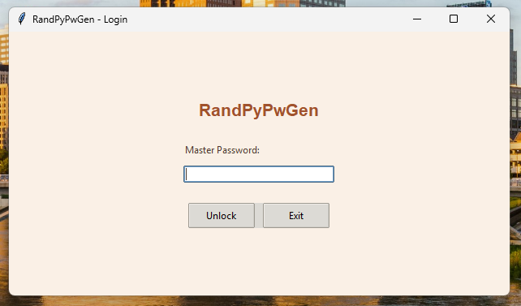
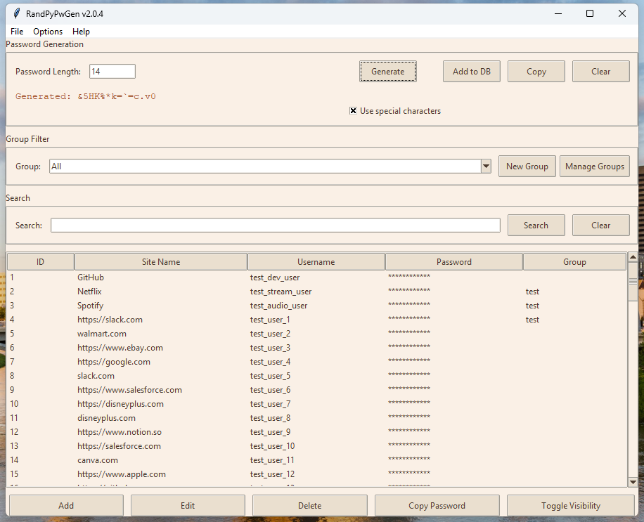
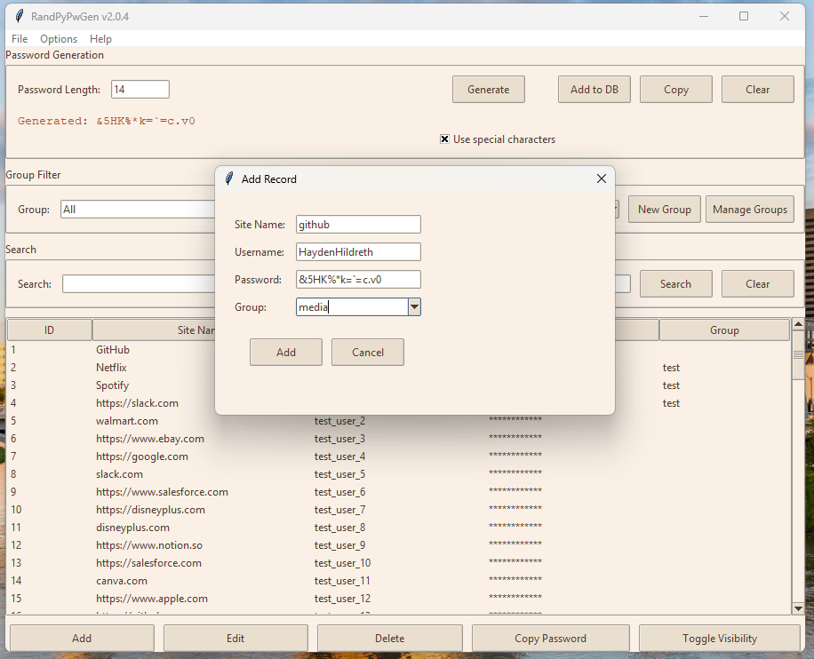
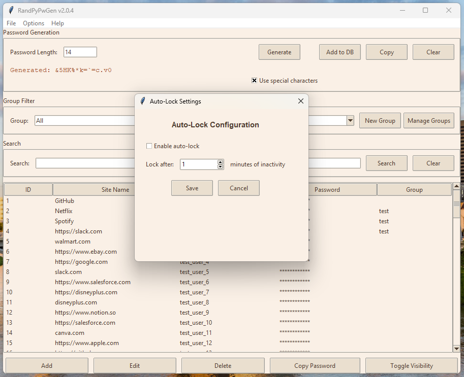
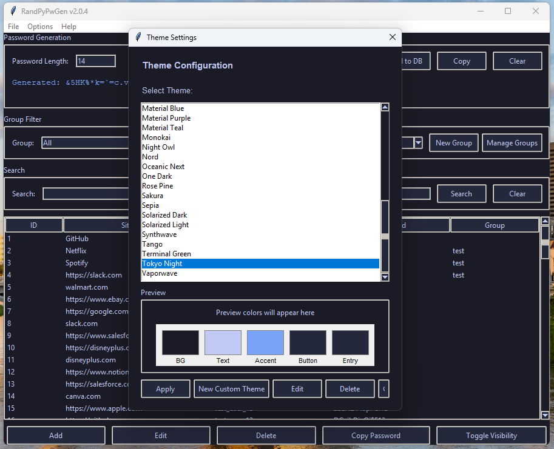
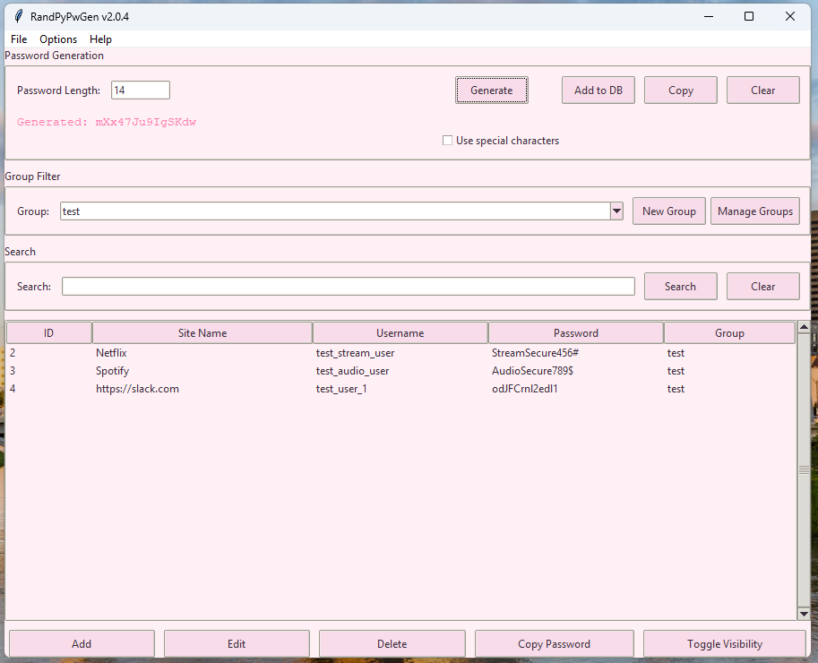

# RandPyPwMan

[](https://github.com/HaydenHildreth/RandPyPwMan/actions/workflows/build-and-release.yml)

## What is RandPyPwMan
It is a simple and easy to use password generator/manager that is open-source and made in Python 3 using Tkinter. It is cross-platform, and able to ran on most major Operating Systems. Program screenshots are available below, or you can view the screenshot folder in the repository.

## Screenshots







## How to use it?
### Windows
Make sure you have [Python 3.10](https://www.python.org/downloads/) or higher installed. You will also need to install [sqlite3](https://www.sqlite.org/download.html) for a database engine. [Make sure you've added sqlite3 to your system PATH](https://dev.to/dendihandian/installing-sqlite3-in-windows-44eb). Users can copy/download the repository and skip cloning the repository, or [install git](https://git-scm.com/download/win) and follow the instructions below.

* Then clone the repository by using (alternatively you can simply download the files):
```
git clone https://github.com/HaydenHildreth/RandPyPwMan.git
```

* Open your terminal and change directory to the correct folder:
```
cd <path-to-repo>\
```

* Install dependencies:
```
py -m pip install -r requirements.txt
```

* Run main script:
```
python main.py
```

### MacOS
* Ensure Python 3.10 or higher is installed

* Clone the repository:
```
git clone https://github.com/HaydenHildreth/RandPyPwMan.git
```

* Open your terminal and change directory to the correct folder:
```
cd <path-to-repo>\
```

* Make setup script executable:
```
chmod +x ./mac_setup.sh
```

* Run setup script:
```
./mac_setup.sh
```

* Activate virtual enviroment
```
source ./venv/bin/activate
```

* Run main script:
```
python main.py
```

* (Optional) Deactivate virtual enviroment:
```
deactivate
```

### Linux
* Ensure Python 3.10 or higher is installed

* Clone the repository:
```
git clone https://github.com/HaydenHildreth/RandPyPwMan.git
```

* Open your terminal and change directory to the correct folder:
```
cd <path-to-repo>\
```

* Make setup script executable:
```
chmod +x ./linux_setup.sh
```

* Run setup script:
```
./linux_setup.sh
```

* Activate virtual enviroment
```
source ./.venv/bin/activate
```

* Run main script:
```
python main.py
```

* (Optional) Deactivate virtual enviroment:
```
deactivate
```

## Features
- Password Manager
- Password Generator
- Groups
- Themes
    - Custom Themes
- Auto-Lock (Idle Lock)
- Importing/Exporting of passwords

## Release Notes
- #### See [CHANGELOG.MD](https://github.com/HaydenHildreth/RandPyPwMan/blob/main/CHANGELOG.md) for change notes.